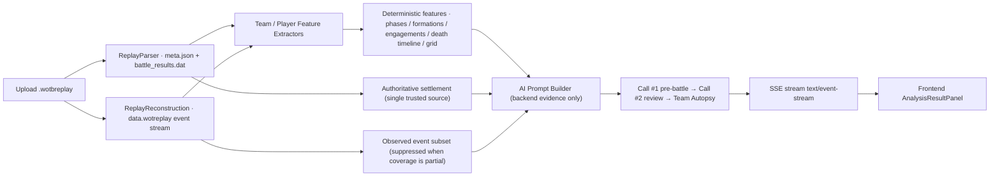

# WoTBTools

A toolset for World of Tanks Blitz: parse `.wotbreplay` replays and export battle data to Excel, online damage leaderboard, real-time rating (Rating V2), AI tactical review (player / team), and Keycloak authentication.

Entry: [https://wotbtools.com](https://wotbtools.com) · Repository: [https://github.com/A158Coke/WotbTools](https://github.com/A158Coke/WotbTools)

## What it does

- **Replay parsing & Excel export**: upload a `.wotbreplay` in the browser, extract authoritative settlement (damage / received / assisted / blocked / kills / death times) plus event-stream features (movement / engagements / 3x3 grid regions).
- **Online damage leaderboard**: per-battle damage ranking for random battles.
- **Real-time rating (Rating V2)**: composite score based on potential damage, assistance, KAST, impact.
- **AI tactical review**: pre-battle prediction + evidence-chain review + liabilities / MVP, streamed token-by-token over SSE; the review keeps running while you switch pages or background the tab (including long team reviews with an ~1100s budget, with results or progress ready on return); points victories state how they ended (time expired / reached 1000 points early) and HP-loss descriptions include time ranges with resolved attacker counts (a single attacker is never called focus fire; only 2+ resolved attackers within a short window (total span ≤ 15s) may be cited as multi-vehicle focus fire); results include a "Map Overview" (friendly/enemy heatmaps + routes + battle playback with progress bar / event jumps / clickable AI-report times + brightness-adaptive colors, 28 maps with assets).
- **Auth & business**: Keycloak (QQ + Wargaming.net ASIA / EU / NA), booster & pilot management.

## Architecture

## AI evidence chain

Replay → **authoritative settlement** (`battle_results.dat`: damage / received / death times) and **event stream** (`data.wotreplay`: movement / engagements / damage events / grid regions) → deterministic features (phase survival counts "at phase end", per-vehicle death timeline for both teams, engagement & focus-fire evidence) → the prompt contains backend evidence only → the AI reviews against the pre-battle baseline (times in Xm Xs, grid regions, our/opponent view) → results stream incrementally with a team autopsy (MVP / liabilities).

## Key engineering trade-offs

1. **Authoritative settlement > observed event stream**: damage / deaths come from `battle_results`; the event stream is only an observed subset, and its numbers are suppressed when coverage is partial (`OBSERVED_DAMAGE_IS_PARTIAL`) — never show two conflicting totals side by side.
2. **SSE streaming, single attempt**: `/api/replay/analyze` is `text/event-stream`; no in-stream retry, failures keep already-emitted output; oversized deltas are split sentence-wise so text always appears incrementally.
3. **Call #2 thinking off by default**: DeepSeek reasoning mode delivers content in one final burst and breaks streaming; enable it only when deeper reasoning is worth it (the chunk fallback still guarantees streaming).
4. **3x3 grid + map semantics**: canonical 500×500 grid regions 1-9; AREA semantics are decoded from client SC2 / heightmap and are not treated as verified facts before manual review.
5. **Structured JSON calls disable thinking**: Call #1 pre-battle and Team Autopsy avoid blank completions (reasoning consuming the output budget).
6. **Bounded worker pool (4+4) + AbortPolicy**: long SSE requests never block servlet threads; saturation returns 503.
7. **Same-server backups with 7-day retention + verification**: single-server infrastructure constraint; no off-site backup yet.

## Documentation

- [DEVELOPER_GUIDE.md](docs/DEVELOPER_GUIDE.md) — architecture, repository layout, routes, i18n, testing, and deployment conventions (must-read for maintainers)
- [java/README.md](java/README.md) — running, APIs, and deployment of the Java / Web version
- [CHANGELOG.md](docs/CHANGELOG.md) — technical version history
- [CHANGELOG-PRODUCT.md](docs/CHANGELOG-PRODUCT.md) — product version history
- [TODO.md](docs/TODO.md) — task list
- [replay-data.md](docs/replay-data.md) — `data.wotreplay` event stream format and fields
- [rating-system.md](docs/rating-system.md) — rating algorithm and parameters
- [observability.md](docs/observability.md) — monitoring / logging / backups
- [team-ai-review-feature.md](docs/team-ai-review-feature.md) — AI team review feature notes
- [auth/wargaming-asia-login.md](docs/auth/wargaming-asia-login.md) — Wargaming.net ASIA / EU / NA login requirements & implementation
- [auth/wargaming-asia-deployment.md](docs/auth/wargaming-asia-deployment.md) — Wargaming login deployment & manual config (ops guide)
- [auth/keycloak-mapper-guide.md](docs/auth/keycloak-mapper-guide.md) — Keycloak Protocol Mapper / Client Scope and production mapper guide

## Quick Start

- Local run / build: see [java/README.md](java/README.md) (local eight-service stack via `docker/online/`)
- Testing and quality gates: see [DEVELOPER_GUIDE.md](docs/DEVELOPER_GUIDE.md)
- Updating the tank database: `cd common/python && python update_tankopedia.py` — generates the four per-tier files (see DEVELOPER_GUIDE)

## Live Tools

Replay parsing & Excel export · Online leaderboard · Real-time rating (Rating V2) · AI tactical review (player / team) · Keycloak authentication · Booster & pilot management
