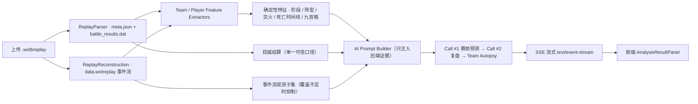

# WoTBTools

《坦克世界闪击战》（World of Tanks Blitz）回放工具集：解析 `.wotbreplay` 战斗数据，提供 Excel 导出、在线伤害排行榜、实时评分（Rating V2）、AI 战术复盘（个人 / 团队）与 Keycloak 认证。

入口：[https://wotbtools.com](https://wotbtools.com) · 仓库：[https://github.com/A158Coke/WotbTools](https://github.com/A158Coke/WotbTools)

## 它做什么

- **回放解析与 Excel 导出**：浏览器上传 `.wotbreplay`，提取权威结算（伤害 / 承伤 / 助攻 / 格挡 / 击杀 / 死亡时刻）与事件流特征（走位 / 交火 / 九宫格区域）。
- **在线伤害排行榜**：随机战斗单场伤害排行。
- **实时评分 Rating V2**：基于潜在均伤、协助、KAST、Impact 的复合评分。
- **AI 战术复盘**：赛前预测 + 证据链复盘 + 战犯 / MVP，SSE 逐段流式展示；复盘期间切换页面或后台化浏览器标签不中断（含团队长复盘约 1100 秒预算，返回后直接看到结果或进度）；点数胜负写明结束方式（时间耗尽 / 达到 1000 分提前获胜），掉血描述带时间范围与攻击者数（单一攻击者不称集火；总跨度 ≤15 秒且有 ≥2 个不同攻击者才可作多车集火证据）；结果页含「地图鸟瞰」（双阵营热力 + 路线筛选（含仅玩家）+ 战局回放（进度条回放 / 事件跳转 / AI 报告时间点击跳转 / 双层车体炮塔标记按车头与炮口方向独立旋转）+ 随地图明暗自适应配色，28 张地图素材）与一键「复制」复盘正文按钮。
- **认证与业务**：Keycloak（QQ + Wargaming.net ASIA / EU / NA）、陪练与打手管理。

## 架构

## AI 证据链

回放 → **权威结算**（`battle_results.dat`：伤害 / 承伤 / 死亡时刻）与**事件流**（`data.wotreplay`：走位 / 交火 / 伤害事件 / 九宫格）→ 确定性特征（阶段边界「至阶段末」存活人数、双方逐车死亡时间线、交火与集火证据）→ Prompt 只注入后端证据 → AI 对照赛前基线复盘（时间统一 X分XX秒、九宫格区域、我方/对方视角）→ 结果页逐段流式展示 + 团队剖析（MVP / 战犯）。

## 核心工程取舍

1. **权威结算 > 事件流观测**：伤害 / 死亡以 `battle_results` 为准；事件流只是观测子集，覆盖不足时抑制数字（`OBSERVED_DAMAGE_IS_PARTIAL`）。
2. **SSE 流式 + 单次尝试**：`/api/replay/analyze` 为 `text/event-stream`；AI 不流内重试；有界 worker 池（4+4）防阻塞，饱和返回 503。
3. **九宫格 + 地图语义化**：500×500 canonical 九宫格 1-9；AREA 语义来自客户端 SC2 / heightmap 解码，人工核验前不当作已验证事实。

> 更多架构与工程取舍见 `docs/DEVELOPER_GUIDE.md` 与 `docs/architecture/`。

## 文档入口

- [docs/README.md](docs/README.md) — 文档索引（架构 / 功能 / 研究 / 运维 / 参考字典，每项「何时读」）
- [DEVELOPER_GUIDE.md](docs/DEVELOPER_GUIDE.md) — 开发入口（环境 / 构建 / 仓库结构 / 约定）
- [java/README.md](java/README.md) — Java / Web 版运行、接口与部署

## 快速开始

- 本地运行 / 构建：见 [java/README.md](java/README.md)（本地八服务 `docker/online/`）
- 测试与质量门禁：见 [DEVELOPER_GUIDE.md](docs/DEVELOPER_GUIDE.md)
- 更新车辆库：手动触发 GitHub Actions `Update Tankopedia`；本地跑 `cd common/python && python update_tankopedia.py`（详见 DEVELOPER_GUIDE）

## 已上线工具

回放解析与 Excel 导出 · 在线排行榜 · 实时评分（Rating V2）· AI 战术复盘（个人 / 团队）· Keycloak 认证（QQ + Wargaming.net ASIA/EU/NA）· 陪练与打手管理
